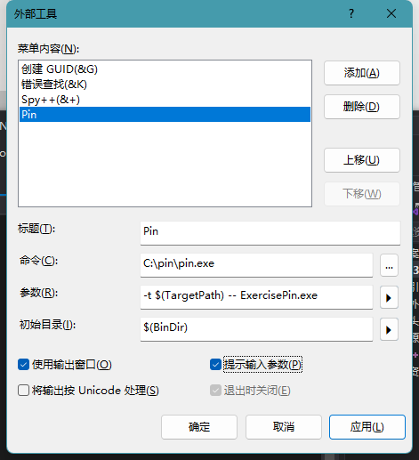

#插桩 
# 环境
## windows

**Make&GCC&G++**

安装cygwin

安装勾选gcc-core g++ make 在devel类别里

然后将bin目录加入path

**编译测试项目**

64位

使用x64 Native Tools Command Prompt for VS 2019

```c
cd C:\\pin\\source\\tools\\ManualExamples
make all TARGET=intel64
```

32位

使用x86 Native Tools Command Prompt for VS 2019，修改C:\pin\source\tools\Config\win.vars中添加一行


```c
cd C:\\pin\\source\\tools\\ManualExamples
make all 
```

## VS集成Pin

在VS中选择工具→外部工具→Add



# 运行

## Examples

### ****Simple Instruction Count （指令插桩）****

统计执行过的指令的总数

```c
/*
 * Copyright (C) 2004-2021 Intel Corporation.
 * SPDX-License-Identifier: MIT
 */

#include <iostream>
#include <fstream>
#include "pin.H"
using std::cerr;
using std::endl;
using std::ios;
using std::ofstream;
using std::string;

ofstream OutFile;

// The running count of instructions is kept here
// make it static to help the compiler optimize docount
static UINT64 icount = 0;

// This function is called before every instruction is executed
//每个指令执行之前运行这个函数
VOID docount() { icount++; }

// Pin calls this function every time a new instruction is encountered
//每遇到一条指令，运行一次这个函数
VOID Instruction(INS ins, VOID* v)
{
    // Insert a call to docount before every instruction, no arguments are passed
    //在每条指令运行之前插入一个函数来计数，没有参数传递
    INS_InsertCall(ins, IPOINT_BEFORE, (AFUNPTR)docount, IARG_END);
}

KNOB< string > KnobOutputFile(KNOB_MODE_WRITEONCE, "pintool", "o", "inscount.out", "specify output file name");

// This function is called when the application exits
//程序退出时运行
VOID Fini(INT32 code, VOID* v)
{
    // Write to a file since cout and cerr maybe closed by the application
    OutFile.setf(ios::showbase);
    OutFile << "Count " << icount << endl;
    OutFile.close();
}

/* ===================================================================== */
/* Print Help Message                                                    */
/* ===================================================================== */

INT32 Usage()
{
    cerr << "This tool counts the number of dynamic instructions executed" << endl;
    cerr << endl << KNOB_BASE::StringKnobSummary() << endl;
    return -1;
}

/* ===================================================================== */
/* Main                                                                  */
/* ===================================================================== */
/*   argc, argv are the entire command line: pin -t <toolname> -- ...    */
/* ===================================================================== */

int main(int argc, char* argv[])
{
    // Initialize pin
    if (PIN_Init(argc, argv)) return Usage();

    OutFile.open(KnobOutputFile.Value().c_str());

    // Register Instruction to be called to instrument instructions
    INS_AddInstrumentFunction(Instruction, 0);

    // Register Fini to be called when the application exits
    PIN_AddFiniFunction(Fini, 0);

    // Start the program, never returns
    PIN_StartProgram();

    return 0;
}
```

-   插曲第一个代码就出现问题
    
    ```c
    C:\\pin\\source\\tools\\ManualExamples\\obj-intel64>pin -t inscount0.dll -- whoami
    E: [tid:23268] Failure to map DLL C:\\pin\\source\\tools\\ManualExamples\\obj-intel64\\inscount0.dll
    E:       System error 216 :
    
    //216是版本不对，我们选择32位dll
    //解决了部分问题，ls还是没有结果是空的
    ```
    

### ****Instruction Address Trace（指令插桩）****

打印执行的指令的地址

```c
/*
 * Copyright (C) 2004-2021 Intel Corporation.
 * SPDX-License-Identifier: MIT
 */

#include <stdio.h>
#include "pin.H"

FILE* trace;

// This function is called before every instruction is executed
// and prints the IP
VOID printip(VOID* ip) { fprintf(trace, "%p\\n", ip); }

// Pin calls this function every time a new instruction is encountered
VOID Instruction(INS ins, VOID* v)
{
    // Insert a call to printip before every instruction, and pass it the IP
    INS_InsertCall(ins, IPOINT_BEFORE, (AFUNPTR)printip, IARG_INST_PTR, IARG_END);
}

// This function is called when the application exits
VOID Fini(INT32 code, VOID* v)
{
    fprintf(trace, "#eof\\n");
    fclose(trace);
}

/* ===================================================================== */
/* Print Help Message                                                    */
/* ===================================================================== */

INT32 Usage()
{
    PIN_ERROR("This Pintool prints the IPs of every instruction executed\\n" + KNOB_BASE::StringKnobSummary() + "\\n");
    return -1;
}

/* ===================================================================== */
/* Main                                                                  */
/* ===================================================================== */

int main(int argc, char* argv[])
{
    trace = fopen("itrace.out", "w");

    // Initialize pin
    if (PIN_Init(argc, argv)) return Usage();

    // Register Instruction to be called to instrument instructions
    INS_AddInstrumentFunction(Instruction, 0);

    // Register Fini to be called when the application exits
    PIN_AddFiniFunction(Fini, 0);

    // Start the program, never returns
    PIN_StartProgram();

    return 0;
}
```

与第一个代码基本相同，区别在于

-   直接定义文件trace = fopen("itrace.out", "w");，避免KNOB< string > KnobOutputFile(KNOB_MODE_WRITEONCE, "pintool", "o", "inscount.out", "specify output file name");
-   插桩的函数要传参加了一个IARG_INST_PTR，所以IARG_INST_PTR=地址

### ****Memory Reference Trace （指令插桩）****

内存引用追踪（只对读写内存的指令插桩）

```c
/*
 * Copyright (C) 2004-2021 Intel Corporation.
 * SPDX-License-Identifier: MIT
 */

/*
 *  This file contains an ISA-portable PIN tool for tracing memory accesses.
 */

#include <stdio.h>
#include "pin.H"

FILE* trace;

// Print a memory read record
VOID RecordMemRead(VOID* ip, VOID* addr) { fprintf(trace, "%p: R %p\\n", ip, addr); }

// Print a memory write record
VOID RecordMemWrite(VOID* ip, VOID* addr) { fprintf(trace, "%p: W %p\\n", ip, addr); }

// Is called for every instruction and instruments reads and writes
VOID Instruction(INS ins, VOID* v)
{
    // Instruments memory accesses using a predicated call, i.e.
    // the instrumentation is called iff the instruction will actually be executed.
    //
    // On the IA-32 and Intel(R) 64 architectures conditional moves and REP
    // prefixed instructions appear as predicated instructions in Pin.
    UINT32 memOperands = INS_MemoryOperandCount(ins);

    // Iterate over each memory operand of the instruction.
    for (UINT32 memOp = 0; memOp < memOperands; memOp++)
    {
        if (INS_MemoryOperandIsRead(ins, memOp))
        {
            INS_InsertPredicatedCall(ins, IPOINT_BEFORE, (AFUNPTR)RecordMemRead, IARG_INST_PTR, IARG_MEMORYOP_EA, memOp,
                                     IARG_END);
        }
        // Note that in some architectures a single memory operand can be
        // both read and written (for instance incl (%eax) on IA-32)
        // In that case we instrument it once for read and once for write.
        if (INS_MemoryOperandIsWritten(ins, memOp))
        {
            INS_InsertPredicatedCall(ins, IPOINT_BEFORE, (AFUNPTR)RecordMemWrite, IARG_INST_PTR, IARG_MEMORYOP_EA, memOp,
                                     IARG_END);
        }
    }
}

VOID Fini(INT32 code, VOID* v)
{
    fprintf(trace, "#eof\\n");
    fclose(trace);
}

/* ===================================================================== */
/* Print Help Message                                                    */
/* ===================================================================== */

INT32 Usage()
{
    PIN_ERROR("This Pintool prints a trace of memory addresses\\n" + KNOB_BASE::StringKnobSummary() + "\\n");
    return -1;
}

/* ===================================================================== */
/* Main                                                                  */
/* ===================================================================== */

int main(int argc, char* argv[])
{
    if (PIN_Init(argc, argv)) return Usage();

    trace = fopen("pinatrace.out", "w");

    INS_AddInstrumentFunction(Instruction, 0);
    PIN_AddFiniFunction(Fini, 0);

    // Never returns
    PIN_StartProgram();

    return 0;
}
```

-   INS_InsertPredicatedCall
-   IARG_MEMORYOP_EA影响的内存地址

### ****Detecting the loading and Unloading of Images（image插桩）****

检测载入的DLL和卸载的DLL

```c
#include<iostream>
#include<fstream>
#include"pin.H"

using std::cerr;
using std::ofstream;
using std::endl;
using std::string;

//定义输出文件
KNOB<string>KnobOutputFile(KNOB_MODE_WRITEONCE, "pintool", "o", "vuleyes.out", "specify filename~");
ofstream TraceFile;
//帮助信息
INT32 Usage() {
	PIN_ERROR("Something Wrong!");
	return -1;
}

VOID ImageLoad(IMG img, VOID* v) { 
	cerr<< "Loading" << IMG_Name(img) << ",Image id=" << IMG_Id(img) << endl;
	TraceFile << "Loading" << IMG_Name(img) << ",Image id=" << IMG_Id(img) << endl;
}
VOID ImageUnload(IMG img, VOID* v) { 
	TraceFile << "Unloading" << IMG_Name(img)  << endl;
	cerr << "Unloading" << IMG_Name(img) << endl;

}

VOID Fini(INT32 code, VOID* V) {
	if (TraceFile.is_open()) {
		TraceFile.close();
	}
}
int main(int argc, char* argv[]) {
	//要使用名称得先初始化符合
	PIN_InitSymbols();
	if (PIN_Init(argc, argv)) return Usage();
	//c_str()返回当前字符串的首字符地址
	TraceFile.open(KnobOutputFile.Value().c_str());
	IMG_AddInstrumentFunction(ImageLoad, 0);
	IMG_AddUnloadFunction(ImageUnload, 0);

	PIN_AddFiniFunction(Fini, 0);

	PIN_StartProgram();

	return 0;

}

C:\\pin\\source\\tools\\MyPinTool\\Release>pin -t MyPinTool.dll -- ExercisePin.exe
LoadingC:\\pin\\source\\tools\\MyPinTool\\Release\\ExercisePin.exe,Image id=1
LoadingC:\\Windows\\SysWOW64\\kernel32.dll,Image id=2
LoadingC:\\Windows\\SysWOW64\\KernelBase.dll,Image id=3
LoadingC:\\Windows\\SysWOW64\\ntdll.dll,Image id=4
LoadingC:\\Windows\\SysWOW64\\apphelp.dll,Image id=5
LoadingC:\\Windows\\SysWOW64\\AcLayers.dll,Image id=6
LoadingC:\\Windows\\SysWOW64\\msvcrt.dll,Image id=7
LoadingC:\\Windows\\SysWOW64\\gdi32.dll,Image id=8
LoadingC:\\Windows\\SysWOW64\\win32u.dll,Image id=9
LoadingC:\\Windows\\SysWOW64\\gdi32full.dll,Image id=10
LoadingC:\\Windows\\SysWOW64\\msvcp_win.dll,Image id=11
LoadingC:\\Windows\\SysWOW64\\ucrtbase.dll,Image id=12
LoadingC:\\Windows\\SysWOW64\\user32.dll,Image id=13
LoadingC:\\Windows\\SysWOW64\\shlwapi.dll,Image id=14
LoadingC:\\Windows\\SysWOW64\\rpcrt4.dll,Image id=15
LoadingC:\\Windows\\SysWOW64\\imm32.dll,Image id=16
LoadingC:\\Windows\\SysWOW64\\vcruntime140.dll,Image id=17
done
LoadingC:\\Windows\\SysWOW64\\kernel.appcore.dll,Image id=18
UnloadingC:\\pin\\source\\tools\\MyPinTool\\Release\\ExercisePin.exe
UnloadingC:\\Windows\\SysWOW64\\kernel32.dll
UnloadingC:\\Windows\\SysWOW64\\KernelBase.dll
UnloadingC:\\Windows\\SysWOW64\\ntdll.dll
UnloadingC:\\Windows\\SysWOW64\\apphelp.dll
UnloadingC:\\Windows\\SysWOW64\\AcLayers.dll
UnloadingC:\\Windows\\SysWOW64\\msvcrt.dll
UnloadingC:\\Windows\\SysWOW64\\gdi32.dll
UnloadingC:\\Windows\\SysWOW64\\win32u.dll
UnloadingC:\\Windows\\SysWOW64\\gdi32full.dll
UnloadingC:\\Windows\\SysWOW64\\msvcp_win.dll
UnloadingC:\\Windows\\SysWOW64\\ucrtbase.dll
UnloadingC:\\Windows\\SysWOW64\\user32.dll
UnloadingC:\\Windows\\SysWOW64\\shlwapi.dll
UnloadingC:\\Windows\\SysWOW64\\rpcrt4.dll
UnloadingC:\\Windows\\SysWOW64\\imm32.dll
UnloadingC:\\Windows\\SysWOW64\\vcruntime140.dll
UnloadingC:\\Windows\\SysWOW64\\kernel.appcore.dll
```

## 漏洞插件学习

****目标/访客程序 (ExercisePin.exe)****

```c
#include <stdio.h>
#include <stdlib.h>

void do_nothing() {
  int *xyz = (int*)malloc(2);
}

int main(int argc, char* argv[]) {
  free(NULL);

  do_nothing();

  char *A = (char*)malloc(128 * sizeof(char));
  char *B = (char*)malloc(128 * sizeof(char));
  char *C = (char*)malloc(128 * sizeof(char));

  free(A);
  free(C);

  if (argc != 2)
    do_nothing();
  else
    free(C);

  puts("done");
  return 0;
}
```

**Heap漏洞检测代码**

```c
#include "pin.h"
#include <iostream>
#include <fstream>
#include <map>
using namespace std;
map<ADDRINT, bool> MallocMap;
ofstream LogFile;
KNOB<string> LogFileName(KNOB_MODE_WRITEONCE, "pintool", "o", "memprofile.out", "Memory trace file name");

VOID LogAfterMalloc(ADDRINT addr)
{
	if (addr == NULL)
	{
		cerr << "[-] Error: malloc() return value was NULL.";
		return;
	}

	map<ADDRINT, bool>::iterator it = MallocMap.find(addr);

	if (it != MallocMap.end())
	{
		if (it->second)
		{
			it->second = false;
		}
		else
		{
			cerr << "[-] Error: allocating memory not freed!?!" << endl;
		}
	}
	else
	{
		MallocMap.insert(pair<ADDRINT, bool>(addr, false));
		LogFile << "\\t\\t= 0x" << hex << addr << endl;
	}

}

VOID LogBeforeMalloc(ADDRINT size)
{
    LogFile << "[*] malloc(" << dec << size << ")";
}

VOID LogFree(ADDRINT addr)
{
    map<ADDRINT, bool>::iterator it = MallocMap.find(addr);

    if (it != MallocMap.end())
    {
        if (it->second)
            LogFile << "[*] Memory at address 0x" << hex << addr << " has been freed more than once." << endl; // Double free
        else
        {
            it->second = true;    // Mark it as freed
            LogFile << "[*] free(0x" << hex << addr << ")" << endl;
        }
    }
    else
        LogFile << "[*] Freeing unallocated memory at address 0x" << hex << addr << "." << endl;
}

VOID CustomInstrumentation(IMG img, VOID* v)
{
    for (SYM sym = IMG_RegsymHead(img); SYM_Valid(sym); sym = SYM_Next(sym))
    {
        //去除修饰的函数名
        string undFuncName = PIN_UndecorateSymbolName(SYM_Name(sym), UNDECORATION_NAME_ONLY);

        if (undFuncName == "malloc")
        {
            //函数地址
            RTN allocRtn = RTN_FindByAddress(IMG_LowAddress(img) + SYM_Value(sym));

            if (RTN_Valid(allocRtn))
            {
                //RTN级别插桩要先执行Open,RTN相当于函数级别
                RTN_Open(allocRtn);

                // Record Malloc size
                //IARG_FUNCARG_ENTRYPOINT_VALUE入口值
                //Type: ADDRINT. Integer argument n. Valid only at the entry point of a routine. (First argument number is 0.)
                //文档标注需要加0
                RTN_InsertCall(allocRtn, IPOINT_BEFORE, (AFUNPTR)LogBeforeMalloc,
                    IARG_FUNCARG_ENTRYPOINT_VALUE, 0, IARG_END);

                // Record Malloc return address
                //IARG_FUNCRET_EXITPOINT_VALUE指向返回函数的指针
                RTN_InsertCall(allocRtn, IPOINT_AFTER, (AFUNPTR)LogAfterMalloc,
                    IARG_FUNCRET_EXITPOINT_VALUE, IARG_END);

                RTN_Close(allocRtn);
            }
        }
        else if (undFuncName == "free")
        {
            RTN freeRtn = RTN_FindByAddress(IMG_LowAddress(img) + SYM_Value(sym));

            if (RTN_Valid(freeRtn))
            {
                RTN_Open(freeRtn);

                RTN_InsertCall(freeRtn, IPOINT_BEFORE, (AFUNPTR)LogFree,
                    IARG_FUNCARG_ENTRYPOINT_VALUE, 0,
                    IARG_END);

                RTN_Close(freeRtn);
            }
        }
    }
}

VOID FinalFunc(INT32 code, VOID* v)
{
    for (pair<ADDRINT, bool> p : MallocMap)
    {
        if (!p.second)
            LogFile << "[*] Memory at address 0x" << hex << p.first << " allocated but not freed" << endl;
    }

    LogFile.close();
}

int main(int argc, char* argv[])
{
    //image级别插桩需要先对Symbols初始化
    PIN_InitSymbols();
    PIN_Init(argc, argv);
    LogFile.open(LogFileName.Value().c_str());
    IMG_AddInstrumentFunction(CustomInstrumentation, NULL);
    PIN_AddFiniFunction(FinalFunc, NULL);
    PIN_StartProgram();

    return 0;
}
```

中间出了点bug,malloclogafter没有运行，重新复制一下就好了，奇怪

### 查看函数的第一个参数

```c
#include<iostream>
#include<fstream>
#include"pin.H"

using std::cerr;
using std::ofstream;
using std::endl;
using std::string;
using std::ios;
using std::hex;

//定义输出文件
KNOB<string>KnobOutputFile(KNOB_MODE_WRITEONCE, "pintool", "o", "vuleyes.out", "specify filename~");
ofstream TraceFile;
//帮助信息
INT32 Usage() {
	PIN_ERROR("Something Wrong!");
	return -1;
}
VOID MallocBefore(CHAR* name, ADDRINT size) {
	cerr<<name << "(" << size << ")" << endl;
	TraceFile << name << "(" << size << ")" << endl;
}
VOID MallocAfter(ADDRINT ret){
	cerr <<"Return:" << ret  << endl;
}
VOID FreeBefore(CHAR* name, ADDRINT size) {
	cerr << name << "(" << size << ")" << endl;
	TraceFile << name << "(" << size << ")" << endl;
}
VOID ImageLoad(IMG img, VOID* v) { 
	//cerr<< "Loading" << IMG_Name(img) << ",Image id=" << IMG_Id(img) << endl;
	/////////////////////////////////////////
	RTN mallocRtn = RTN_FindByName(img, "malloc");
	if (RTN_Valid(mallocRtn)) {
		RTN_Open(mallocRtn);
		//不太理解这里IARG_ADDRINT用法
		//理解的话这是malloc的类型？？？？
		//换成IARG_PTR也正常运行
		RTN_InsertCall(mallocRtn, IPOINT_BEFORE, (AFUNPTR)MallocBefore, IARG_PTR, "malloc", IARG_FUNCARG_ENTRYPOINT_VALUE, 0, IARG_END);
		RTN_InsertCall(mallocRtn, IPOINT_AFTER, (AFUNPTR)MallocAfter, IARG_FUNCRET_EXITPOINT_VALUE, IARG_END);

		RTN_Close(mallocRtn);
	}
	RTN freeRtn = RTN_FindByName(img, "free");
	if (RTN_Valid(freeRtn)) {
		RTN_Open(freeRtn);
		
		RTN_InsertCall(freeRtn, IPOINT_BEFORE, (AFUNPTR)FreeBefore, IARG_PTR, "free", IARG_FUNCARG_ENTRYPOINT_VALUE, 0, IARG_END);

		RTN_Close(freeRtn);
	}

}
VOID ImageUnload(IMG img, VOID* v) { 
	//cerr << "Unloading" << IMG_Name(img) << endl;

}

VOID Fini(INT32 code, VOID* V) {
	if (TraceFile.is_open()) {
		TraceFile.close();
	}
}
int main(int argc, char* argv[]) {
	//要使用名称得先初始化符合
	PIN_InitSymbols();
	if (PIN_Init(argc, argv)) return Usage();
	//c_str()返回当前字符串的首字符地址
	TraceFile.open(KnobOutputFile.Value().c_str());
	//ios::showbase是显示进制
	TraceFile << hex;
	TraceFile.setf(ios::showbase);
	IMG_AddInstrumentFunction(ImageLoad, 0);
	IMG_AddUnloadFunction(ImageUnload, 0);

	PIN_AddFiniFunction(Fini, 0);

	PIN_StartProgram();

	return 0;

}
```

## bak

```c
#include<iostream>
#include<fstream>
#include"pin.H"

#ifdef _WIN32
#define flagSystem 0
#elif __linux__
#define flagSystem 1
#elif __APPLE__
#define flagSystem 2
#endif

namespace WINDOWS 
{
#include<C:\\Program Files (x86)\\Windows Kits\\10\\Include\\10.0.19041.0\\um\\windows.h>
}

using std::cerr;
using std::ofstream;
using std::endl;
using std::string;
using std::ios;
using std::hex;
using std::dec;

//定义输出文件
KNOB<string>KnobOutputFile(KNOB_MODE_WRITEONCE, "pintool", "o", "vuleyes.out", "specify filename~");
ofstream TraceFile;
//帮助信息
INT32 Usage() {
	PIN_ERROR("Something Wrong!");
	return -1;
}
VOID MallocBefore(CHAR* name, ADDRINT size) {
	cerr<<name << "(" << size << ")" << endl;
	TraceFile << name << "(" << size << ")" << endl;
}
VOID MallocAfter(ADDRINT ret){
	cerr <<"Return:" << ret  << endl;
}
VOID FreeBefore(CHAR* name, ADDRINT size) {
	cerr << name << "(" << size << ")" << endl;
	TraceFile << name << "(" << size << ")" << endl;
}

VOID Before(CHAR* name, WINDOWS::HANDLE hHeap, WINDOWS::DWORD dwFlags, WINDOWS::DWORD dwBytes)
{
	cerr << "Before: " << name << "(" << hex << hHeap << ", " << dwFlags << ", " << dwBytes << ")" << dec << endl;
}

VOID After(CHAR* name, ADDRINT ret) { cerr << "After: " << name << "  returns " << hex << ret << dec << endl; }
VOID ImageLoad(IMG img, VOID* v) { 
	//cerr<< "Loading" << IMG_Name(img) << ",Image id=" << IMG_Id(img) << endl;
	/////////////////////////////////////////
	//flagSystem==0
	if (flagSystem == 0) {
		for (SYM sym = IMG_RegsymHead(img); SYM_Valid(sym); sym = SYM_Next(sym)) {
			string undFuncName = PIN_UndecorateSymbolName(SYM_Name(sym), UNDECORATION_NAME_ONLY);
			if (undFuncName == "RtlAllocHeap ") {
				RTN allocRtn = RTN_FindByAddress(IMG_LowAddress(img) + SYM_Value(sym));
				if (RTN_Valid(allocRtn)) {
					RTN_Open(allocRtn);
					RTN_InsertCall(allocRtn, IPOINT_BEFORE, (AFUNPTR)Before, IARG_ADDRINT, "RtlAllocateHeap", IARG_FUNCARG_ENTRYPOINT_VALUE, 0, IARG_FUNCARG_ENTRYPOINT_VALUE, 1, IARG_FUNCARG_ENTRYPOINT_VALUE,
						2, IARG_END);
					RTN_InsertCall(allocRtn, IPOINT_AFTER, (AFUNPTR)After, IARG_ADDRINT, "RtlAllocateHeap",
						IARG_FUNCRET_EXITPOINT_VALUE, IARG_END);
					RTN_Close(allocRtn);
				}
			}
			TraceFile << undFuncName << endl;
		}

	}

	//flagSystem==1 mean linux
	else if (flagSystem == 1) {
		RTN mallocRtn = RTN_FindByName(img, "malloc");
		if (RTN_Valid(mallocRtn)) {
			RTN_Open(mallocRtn);
			//不太理解这里IARG_ADDRINT用法
			//理解的话这是malloc的类型？？？？
			//换成IARG_PTR也正常运行
			RTN_InsertCall(mallocRtn, IPOINT_BEFORE, (AFUNPTR)MallocBefore, IARG_PTR, "malloc", IARG_FUNCARG_ENTRYPOINT_VALUE, 0, IARG_END);
			RTN_InsertCall(mallocRtn, IPOINT_AFTER, (AFUNPTR)MallocAfter, IARG_FUNCRET_EXITPOINT_VALUE, IARG_END);

			RTN_Close(mallocRtn);
		}
		RTN freeRtn = RTN_FindByName(img, "free");
		if (RTN_Valid(freeRtn)) {
			RTN_Open(freeRtn);

			RTN_InsertCall(freeRtn, IPOINT_BEFORE, (AFUNPTR)FreeBefore, IARG_PTR, "free", IARG_FUNCARG_ENTRYPOINT_VALUE, 0, IARG_END);

			RTN_Close(freeRtn);
		}

	}
	

}
VOID ImageUnload(IMG img, VOID* v) { 
	//cerr << "Unloading" << IMG_Name(img) << endl;

}

VOID Fini(INT32 code, VOID* V) {
	if (TraceFile.is_open()) {
		TraceFile.close();
	}
}
int main(int argc, char* argv[]) {
	//要使用名称得先初始化符号
	cerr << flagSystem << endl;
	PIN_InitSymbols();
	if (PIN_Init(argc, argv)) return Usage();
	//c_str()返回当前字符串的首字符地址
	TraceFile.open(KnobOutputFile.Value().c_str());
	//ios::showbase是显示进制
	TraceFile << hex;
	TraceFile.setf(ios::showbase);
	IMG_AddInstrumentFunction(ImageLoad, 0);
	IMG_AddUnloadFunction(ImageUnload, 0);

	PIN_AddFiniFunction(Fini, 0);

	PIN_StartProgram();

	return 0;

}
```

## 自定义Pintool代码

在pin/source/tools目录下的MyPinTool项目，直接修改就行，修改前做一次备份，用以写第二个代码

# 漏洞检测规则

Double Free

**Negative mallocs**

检测malloc(size)中size是否小于0

针对malloc和calloc

例如在32位系统中，malloc(-1)会尝试分配4GB内存

**Zero allocations**

检测malloc(size)中size是否等于0

针对malloc和calloc

malloc(0)通常返回当前系统允许的堆的最小内存块，如果超过这个大小的数据被写入这个buffer,就会造成堆溢出

# 附录

## malloc

```c
void *malloc(size_t n);

该函数返回对应大小字节的内存块的指针

此外，该函数还对一些异常情况进行了处理

当n=0时，返回当前系统允许的堆的最小内存块

当n为负数时，由于在大多数系统中，size_t是无符号数，所以程序就会申请很大的内存空间，但通常来说都会失败，因为系统没有那么多的内存可以分配
```

## free

```c
void free(void *p);

该函数会释放由p所指向的内存块。这个内存块有可能是通过malloc函数得到的，也有可能是通过相关的函数realloc得到的 该函数还对异常情况进行了一下处理 

当p为空指针时，函数不执行任何操作

当p已经被释放之后，再次释放会出现错误的效果，这其实就是double free

除了被禁用（mallocpt）的情况下，当释放很大的内存空间时，程序会将这些内存空间还给系统，以便减小程序所使用的内存空间
```

# 错误

```c
严重性	代码	说明	项目	文件	行	禁止显示状态
错误	C1189	#error:  Must define _WINDOWS_H_PATH_	MyPinTool	C:\\pin\\extras\\crt\\include\\Windows.h	36
//include<Windows.h>
#include<C:\\Program Files (x86)\\Windows Kits\\10\\Include\\10.0.19041.0\\um\\windows.h>

```

# 参考链接
[【安全红队】CPU侧信道之Intel Pin工具的使用](https://www.istt.org.cn/NewsDetail/2672118.html)

[Pin: Pin 3.22 User Guide](https://software.intel.com/sites/landingpage/pintool/docs/98547/Pin/html/index.html)

[](https://github.com/joxeankoret/membugtool)[https://github.com/joxeankoret/membugtool](https://github.com/joxeankoret/membugtool)